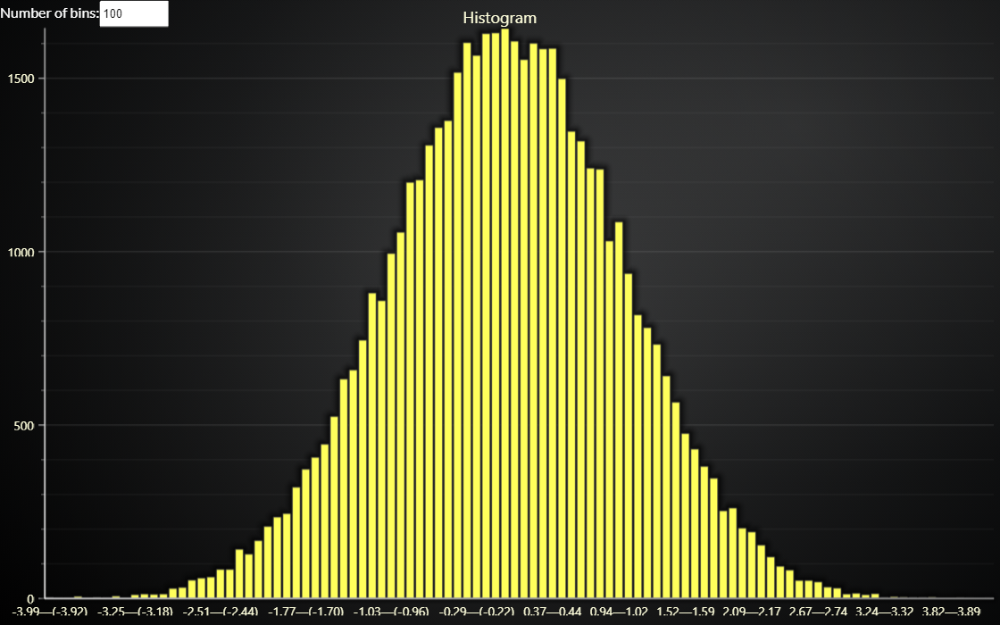

# JavaScript Histogram of Gaussian Distribution.



This demo application belongs to the set of examples for LightningChart JS, data visualization library for JavaScript.

LightningChart JS is entirely GPU accelerated and performance optimized charting library for presenting massive amounts of data. It offers an easy way of creating sophisticated and interactive charts and adding them to your website or web application.

The demo can be used as an example or a seed project. Local execution requires the following steps:

-   Make sure that relevant version of [Node.js](https://nodejs.org/en/download/) is installed
-   Open the project folder in a terminal:

          npm install              # fetches dependencies
          npm start                # builds an application and starts the development server

-   The application is available at _http://localhost:8080_ in your browser, webpack-dev-server provides hot reload functionality.


## Description

Example showcasing LightningChart Histogram visualization using Bar Chart.

Bar Chart can be used as a histogram by calculating the bins manually using the following function:

```js
const calculateHistogramBins = (data, numberOfBins) => {
    const minValue = Math.min(...data)
    const maxValue = Math.max(...data)
    const binSize = (maxValue - minValue) / numberOfBins

    // Calculate bin intervals
    const bins = []
    for (let i = 0; i < numberOfBins; i++) {
        const binStart = minValue + i * binSize
        const binEnd = minValue + (i + 1) * binSize
        bins.push({
            binStart: parseFloat(binStart.toFixed(2)),
            binEnd: parseFloat(binEnd.toFixed(2)),
            values: Array(),
        })
    }
    bins[numberOfBins - 1].binEnd = maxValue

    // Map data to bins
    data.forEach((value) => {
        const binIndex = Math.floor((value - minValue) / binSize)
        if (binIndex >= 0 && binIndex < numberOfBins) {
            bins[binIndex].values.push(value)
        }
    })

    // Create input data for bar chart
    const barChartData = []
    bins.forEach((interval) => {
        barChartData.push({
            category: `${(interval.binStart + (interval.binStart === minValue ? 0 : 0.01)).toFixed(2)}—${
                interval.binEnd < 0 ? `(${interval.binEnd.toFixed(2)})` : interval.binEnd.toFixed(2)
            }`,
            value: interval.values.length,
        })
    })
    return barChartData
}
```

In this example, a normally distributed dataset is generated by the [Box–Muller transform method](https://en.wikipedia.org/wiki/Box%E2%80%93Muller_transform):

```js
const generateGaussianRandom = (length) => {
    const samples = []
    for (let i = 0; i < length; i++) {
        let u = 0,
            v = 0,
            s = 0
        while (s === 0 || s >= 1) {
            u = Math.random() * 2 - 1
            v = Math.random() * 2 - 1
            s = u * u + v * v
        }
        const temp = Math.sqrt((-2 * Math.log(s)) / s)
        const sample = u * temp
        samples.push(sample)
    }
    return samples
}
```

In order to preserve the bell curve shape, automatic sorting has to be turned off by `barChart.setSorting(BarChartSorting.Disabled)`

The number of histogram bins can be changed dynamically by the user using the HTML number input. The chart updates automatically from these interactions.


## API Links

* [Bar Chart]
* [Bar Chart Bar]
* [Bar Chart Value Axis ]
* [Bar Chart Category Axis]
* [Bar Chart Types]
* [Bar Chart Sorting]


## Support

If you notice an error in the example code, please open an issue on [GitHub][0] repository of the entire example.

Official [API documentation][1] can be found on [LightningChart][2] website.

If the docs and other materials do not solve your problem as well as implementation help is needed, ask on [StackOverflow][3] (tagged lightningchart).

If you think you found a bug in the LightningChart JavaScript library, please contact sales@lightningchart.com.

Direct developer email support can be purchased through a [Support Plan][4] or by contacting sales@lightningchart.com.

[0]: https://github.com/Arction/
[1]: https://lightningchart.com/lightningchart-js-api-documentation/
[2]: https://lightningchart.com
[3]: https://stackoverflow.com/questions/tagged/lightningchart
[4]: https://lightningchart.com/support-services/

© LightningChart Ltd 2009-2022. All rights reserved.


[Bar Chart]: https://lightningchart.com/js-charts/api-documentation/v5.1.0/interfaces/BarChart.html
[Bar Chart Bar]: https://lightningchart.com/js-charts/api-documentation/v5.1.0/classes/BarChartBar.html
[Bar Chart Value Axis ]: https://lightningchart.com/js-charts/api-documentation/v5.1.0/classes/BarChartValueAxis.html
[Bar Chart Category Axis]: https://lightningchart.com/js-charts/api-documentation/v5.1.0/classes/BarChartCategoryAxis.html
[Bar Chart Types]: https://lightningchart.com/js-charts/api-documentation/v5.1.0/variables/BarChartTypes.html
[Bar Chart Sorting]: https://lightningchart.com/js-charts/api-documentation/v5.1.0/variables/BarChartSorting.html

